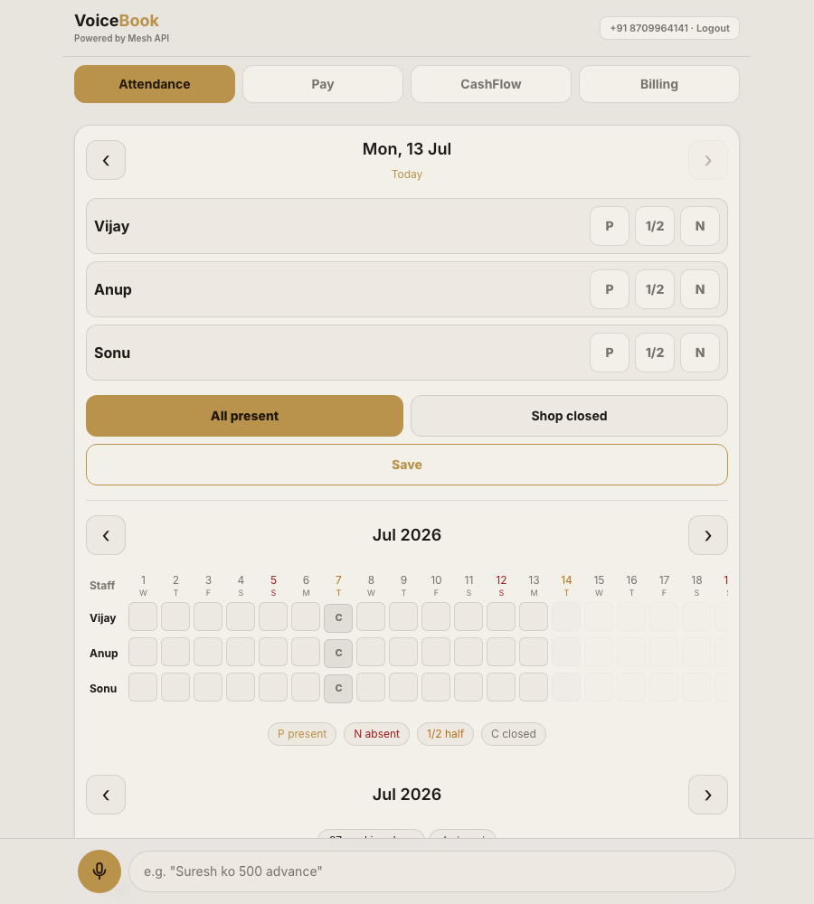
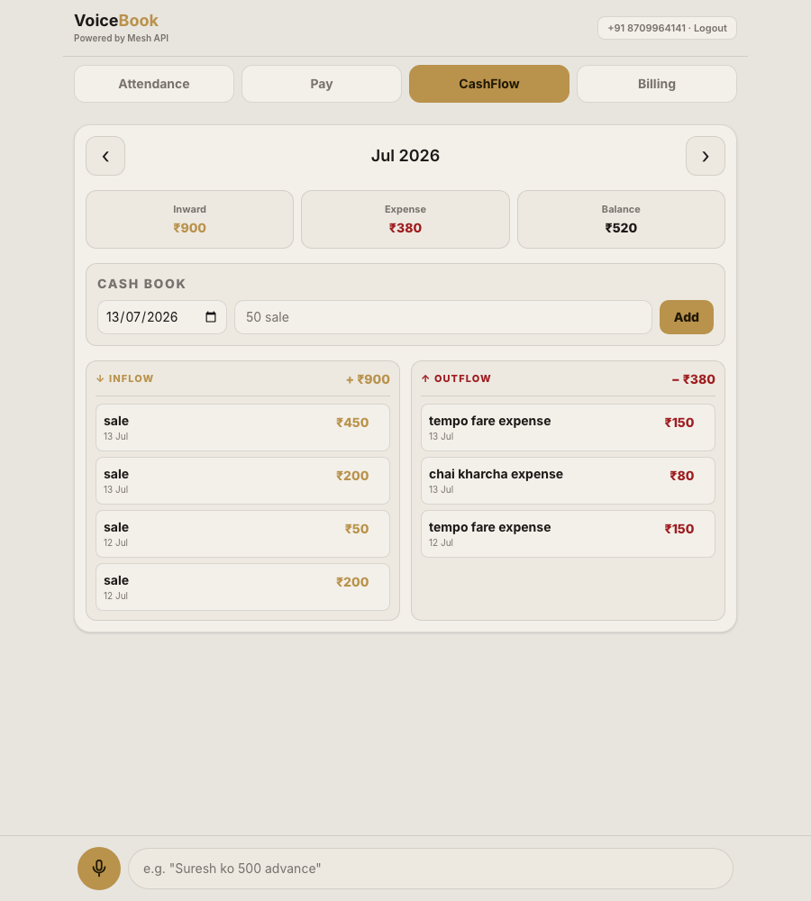
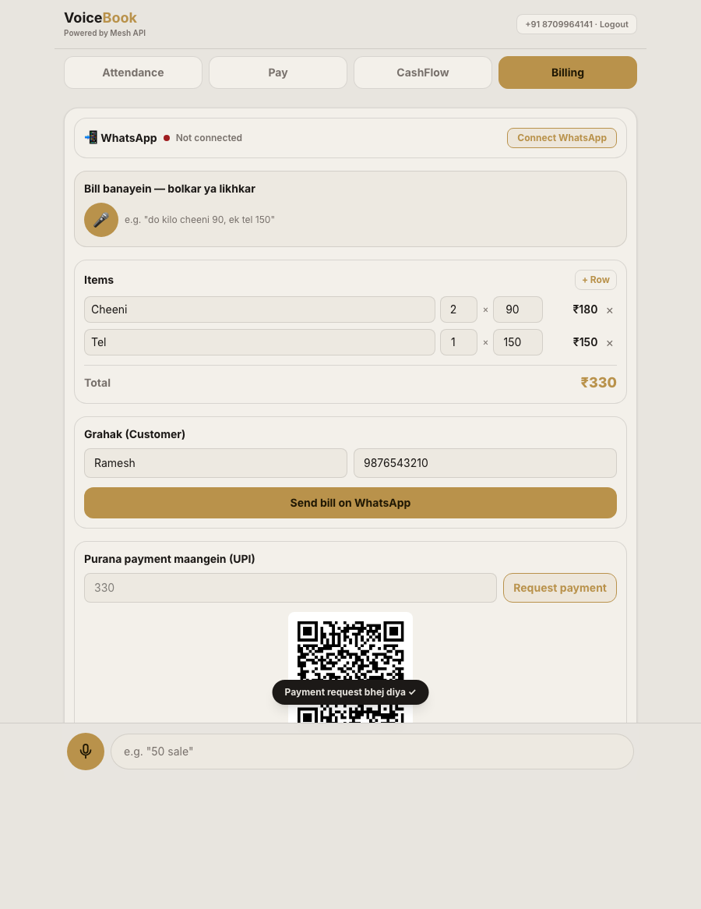

<div align="center">

# Voice<span style="color:#c9a45c">Book</span>

**Voice-first shop management for India's kirana and small-shop owners.**
Bolo. Bill bhejo. Order lo.

[](https://voicebook-seven.vercel.app)
[](https://meshapi.ai)
[](https://hack.meshapi.ai)

**[🔗 Live App](https://voicebook-seven.vercel.app)** · **[📄 Source](https://github.com/StarkAg/voicebook)**

</div>

---

Most kirana and small-shop owners in India can't type fast and aren't comfortable reading English — yet every "shop app" assumes both. VoiceBook doesn't. **Speak Hindi, Hinglish, or English** and it marks attendance, logs advances, tracks the cash book, and builds a bill — then **sends it over WhatsApp and speaks the confirmation back to you.**

And the part that makes it more than a form with a microphone: **customers can text that same WhatsApp number to order again**, and a Mesh-powered chat takes the order for you.

## Screenshots

<table>
<tr>
<td width="33%"><br/><sub align="center">Attendance — marked by voice, "Ramesh present, Suresh ko 500 advance"</sub></td>
<td width="33%"><br/><sub>Cash book — inflow left, outflow right, "50 sale" / "150 tempo fare expense"</sub></td>
<td width="33%"><br/><sub>Bill dictated by voice → sent on WhatsApp → UPI QR payment request</sub></td>
</tr>
</table>

## What it does

- 🎙️ **Speak to log** — "Ramesh present, Suresh ko 500 advance" → attendance marked, advance logged, confirmed out loud.
- 💰 **Voice cash book** — "50 sale" / "150 tempo fare expense" → posted straight into a two-column inflow/outflow ledger.
- 🧾 **Voice-to-bill** — "do kilo cheeni 90, ek tel 150" → an editable, itemized bill.
- 📲 **WhatsApp in one tap** — send the bill, or generate a UPI QR and request a payment, both delivered on WhatsApp via a self-hosted worker.
- 🤖 **AI order-taking chatbot** — a customer who's received a bill can text that same WhatsApp number to order again. Mesh runs the conversation, confirms in their language, and drops a ready-to-price draft bill into the owner's app — zero app download for the customer.
- 🔐 **OTP phone login** — every shop owner gets a private, isolated khata (Fast2SMS).
- 📱 **Installable PWA** — no app store, works straight from the browser.

## How Mesh powers it

Every AI call in VoiceBook — for the owner **and** for the customer-facing chatbot — routes through Mesh.

| Step | Mesh capability | Used for |
| --- | --- | --- |
| Voice → text | Audio transcription (STT) | Turning spoken Hindi/Hinglish/English into text |
| Understand & act | Chat completions | Structured attendance/cash/bill actions **and** the WhatsApp order-taking conversation |
| Answer → voice | Text-to-speech (TTS) | Speaking the confirmation back to the owner |

The Mesh key never reaches the browser: [`convex/http.ts`](convex/http.ts) is a Mesh proxy served from Convex that every client call goes through. [`src/lib/mesh.ts`](src/lib/mesh.ts) calls STT/chat/TTS; [`src/lib/agent.ts`](src/lib/agent.ts) and [`src/lib/bill.ts`](src/lib/bill.ts) turn transcribed speech into structured actions; [`convex/orderBot.ts`](convex/orderBot.ts) calls Mesh chat directly, server-side, to run the WhatsApp ordering chat.

## Architecture

```
Vercel  — the PWA frontend
Convex  — data, OTP auth, the Mesh proxy, and the WhatsApp send queue
Railway — an always-on WhatsApp worker (Baileys), session held in Convex
```

Phone-OTP login (Fast2SMS) makes it fully multi-tenant — every shop's attendance, cash book, customers, and bills are private to that owner.

## Run locally

```bash
npm install
cp .env.example .env.local   # add your Mesh key (rsk_...) and Convex URL
npx convex dev                # starts the Convex dev backend
npm run dev
```

The WhatsApp worker lives in [`worker/`](worker) — see [`worker/README.md`](worker/README.md) for the Railway deploy + WhatsApp linking steps.

## Stack

React 19 + TypeScript + Vite + Tailwind v4 · Convex (data, auth, Mesh proxy) · Baileys on Railway (WhatsApp) · Fast2SMS (OTP) · Every AI call via [Mesh API](https://meshapi.ai).
